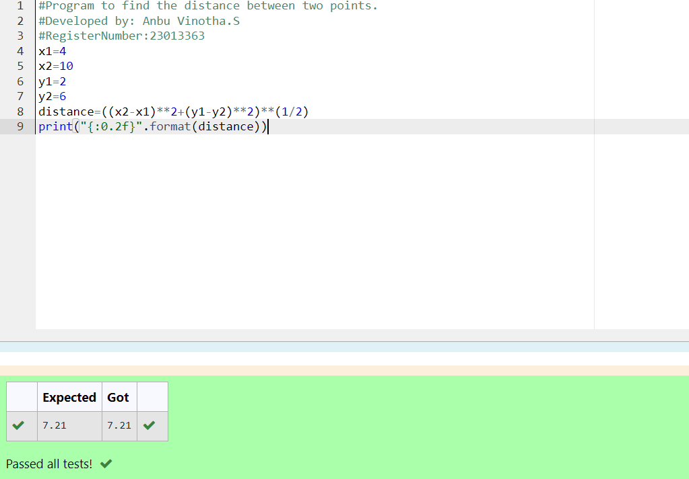

# DISTANCE-BETWEEN-TWO-POINTS

## AIM:
To write a python program to find the distance two 2 points
## ALGORITHM:
### Step 1: 
### Step 2: 
### Step 3: 
Substitute the values in the distance formula  
### Step 4: 
### Step 5: 
### PROGRAM:
```
#Program to find the distance between two points.
#Developed by: Anbu Vinotha.S
#RegisterNumber:23013363
x1=4
x2=10
y1=2
y2=6
distance=((x2-x1)**2+(y1-y2)**2)**(1/2)
print("{:0.2f}".format(distance))

```
### OUTPUT:


### RESULT:
